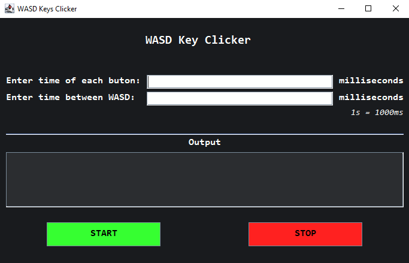

<h1 align="center">Simple AutoClickers</h1>

Automating mouse clicker and WASD keys press on keyboard.

Written in Java using Swing.

Images

- AutoClicker:

 

- WASD: 

## How to run

1. Make sure you have Java installed on you system,
2. Make sure you have added Java to you Environment Variables.

Just run the _.bat_ files inside _jar_ folder.

I've mainly made these clickers for my own purposes. These applications <b>are not stable</b> and need to be improved, but they'll do the job.

<i>Note: Forms will stop working only until the entire program is completed or until they are manually turned off.</i>